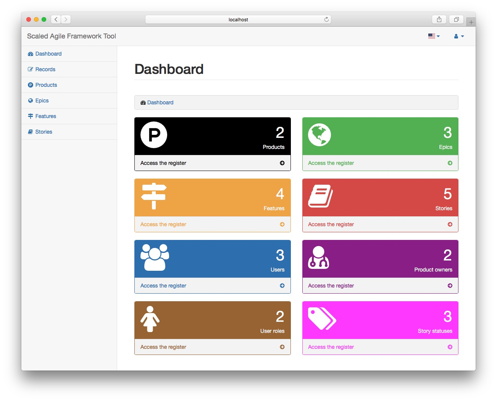
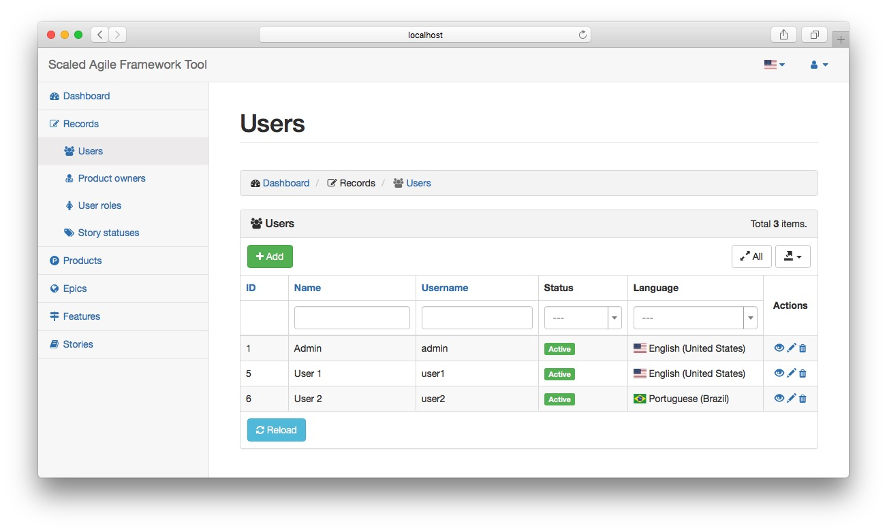
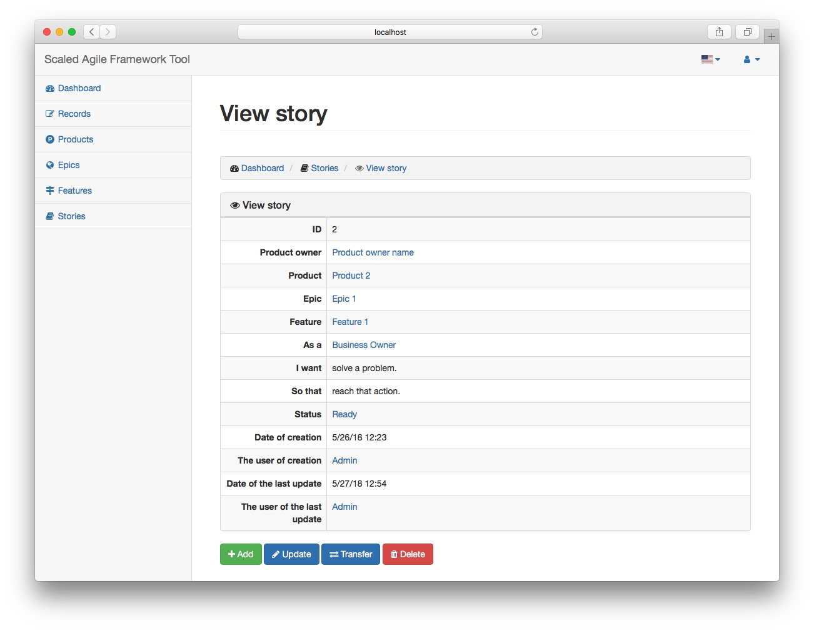
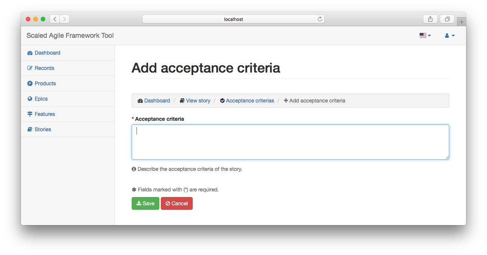

Scaled Agile Framework Tool
=============================================================================

This tool was created as a final work of my Agile Software Engineering MBA.
The main goal is let the product owners manage their own user stories using the Scaled Agile Framework as the basis.

Currently, this tool has the following resources:

 - **User roles**: control of user roles to stories.
 - **Story status**: control of story status.
 - **Product owners**: control of product owners from each story.
 - **Products**: control stories to many different products.
 - **Epics**: control the epics of a product.
 - **Features**: control the features of an epic.
 - **Stories**: control user stories of a feature.
 - **Acceptance criterias**: definition of acceptance criterias for each story.
 
This tool was developed with this following resources:

 - [PHP 7](http://www.php.net)
 - [MySQL 5](http://www.mysql.com)
 - [Yii Framework 2](http://www.yiiframework.net)
 - [Bootstrap 3](http://getbootstrap.com)
 - [Font-awesome 4.7](http://fontawesome.io)
 - [Krajee Components for Yii2](http://demos.krajee.com)
 - [Flag Icon CSS](http://flag-icon-css.lip.is)
 - [SBAdmin v2.0](https://startbootstrap.com/template-overviews/sb-admin-2/)
 - [MySQL Workbench](https://www.mysql.com/products/workbench/)

Made with &hearts; by Ivan Wilhelm.

Coded with [PhpStorm EAP](https://www.jetbrains.com/phpstorm/eap/) by [JetBrains](https://www.jetbrains.com/)

Screens of the tools:
--------------------

Follows some screens of the tool.

**Main page**

**Users**

**Story control**

